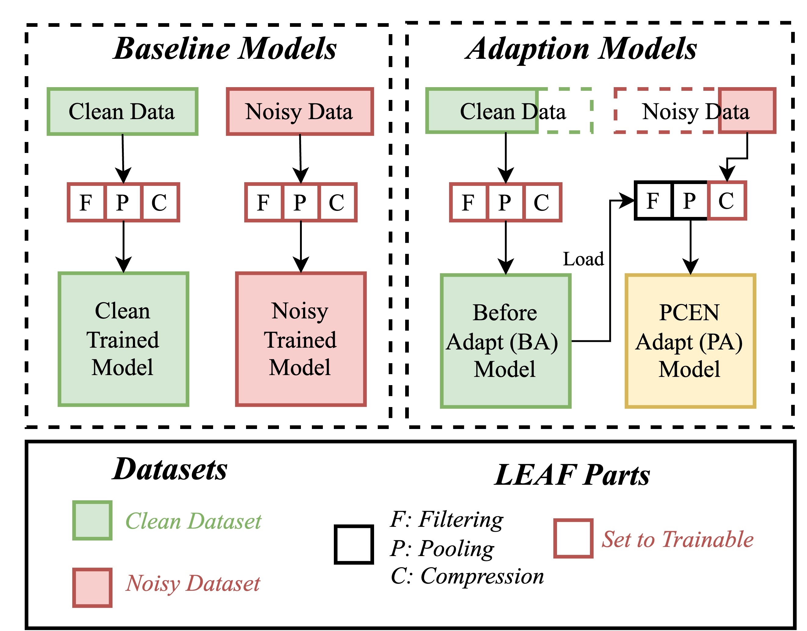
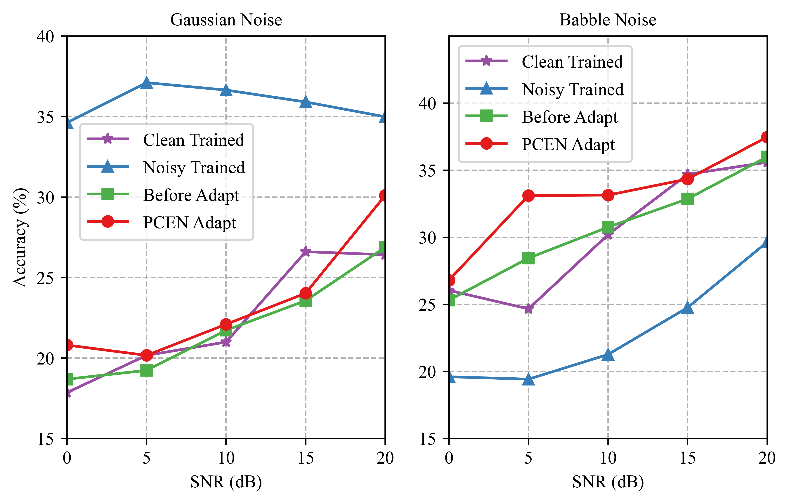

# Adapting-LEAF
The PCEN Adapting experiments under two kinds of noisy environments for INTERSPEECH 2023 Paper.

## Introduction
This is the source code for adapting PCEN layer in LEAF under noisy environment.

## Experimental Setups and Results
**1. Four model to be trained**
<p align="center">
    
</p>

* **Clean Trained**: Trained on the entire noise-free training set (baseline). 
* **Noisy Trained**: Trained on the noisy version of the entire training data. 
* **Before Adapt**: Trained on the noise-free training set without including adaptation data.
* **PCEN Adapt**: The BA model with the PCEN layer was adapted using the noisy adaptation data. 

As for the backend, we use the same back-end (EfficientNetB0) as the original LEAF paper.

**2. Speech Processing Task: Emotion Recognition**

**3. Dataset and Partition**

We applied the CREMA-D Dataset with the following partition:
<p align="center">
    
</p>

**4. Noise Setups**
1. We varying the Signal-to-Noise Ratio (SNR): from 0 to 20 dB with 5dB increment (We trained all 4 models under 0 dB, 5 dB, 10 dB, 15 dB, 20 dB SNR correspondingly).
2. Two representative classes of noise were chosed
    * **Gaussian Noise (Stationary Noise)**
    * **Babble Noise (Non-stationary Noise)**
        * We create the babble noise environment by randomly select 3 speech samples from the **MUSAN** dataset and mixed them up.
        * The availablity of MUSAN dataset: [Download](https://www.openslr.org/17/)
        
**5. Results and Analysis**
We evaluate the accuracy of the overall model accuracy under noisy environments (adding different kinds and level of noise to the test set).
The accuracy of all 4 models under different kinds/levels or noise is shown as follow:
<p align="center">
    
</p>

## Getting Started
### Prequest
    - python=3.8 
    - setuptools==59.5.0
    - numpy==1.23.3
    - tqdm
    - tensorboard
    - pytorch==1.10.0
    - tensorflow-datasets
    - efficientnet_pytorch
    - PySoundFile
    - soundfile

### Installation
```bash
git clone https://github.com/Hanyu-Meng/Adapting-LEAF.git
```
## Configrations


## File Structures
```bash
.
├── Adapting-LEAF
│   ├── Job_script
│   │   ├── main.py
│   │   ├── utils.py
│   ├── Noise_dataset_create
│   │   ├── image1.png
│   │   ├── image2.jpg
│   ├── Pre-trained models
│   │   ├── Babble Noise
│   │       ├── babble_BA_0db
│   │           ├── args.txt
│   │           ├── final_metrics.txt
│   │           ├── net_checkpoint.pth
│   │           ├── net_last_model.pth
│   │       ├── .....
│   │ 
│   │   ├── Gaussian Noise
│   │       ├── BA_0db
│   │           ├── args.txt
│   │           ├── final_metrics.txt
│   │           ├── net_checkpoint.pth
│   │           ├── net_last_model.pth
│   │       ├── .....
│   │   
│   └── data
│       ├── data1.csv
│       ├── data2.csv
```
## Pretained Models

## References

## Acknowledgement


