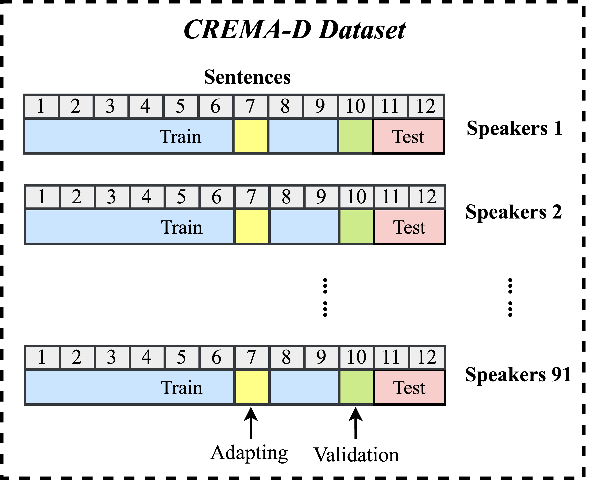

# Adapting-LEAF
The PCEN Adapting experiments under two kinds of noisy environments for INTERSPEECH 2023 Paper.

## Introduction
This is the source code for adapting PCEN layer in LEAF under noisy environment.

## Experimental Setups and Results
**1. Four model to be trained**

* **Clean Trained**: Trained on the entire noise-free training set (baseline). 
* **Noisy Trained**: Trained on the noisy version of the entire training data. 
* **Before Adapt**: Trained on the noise-free training set without including adaptation data.
* **PCEN Adapt**: The BA model with the PCEN layer was adapted using the noisy adaptation data. 

**2. Speech Processing Task: Emotion Recognition**
**3. Dataset and Partition**
We applied the CREMA-D Dataset with the following partition:

## Getting Started
### Prequest
    - python=3.8
    - setuptools==59.5.0
    - numpy==1.23.3
    - tqdm
    - tensorboard
    - pytorch==1.10.0
    - tensorflow-datasets
    - efficientnet_pytorch
    - PySoundFile
    - soundfile

```bash
git clone https://github.com/Hanyu-Meng/Adapting-LEAF.git


## Configration

## Credit

